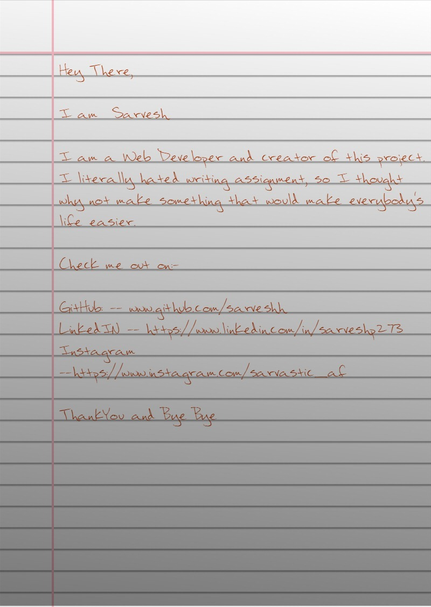
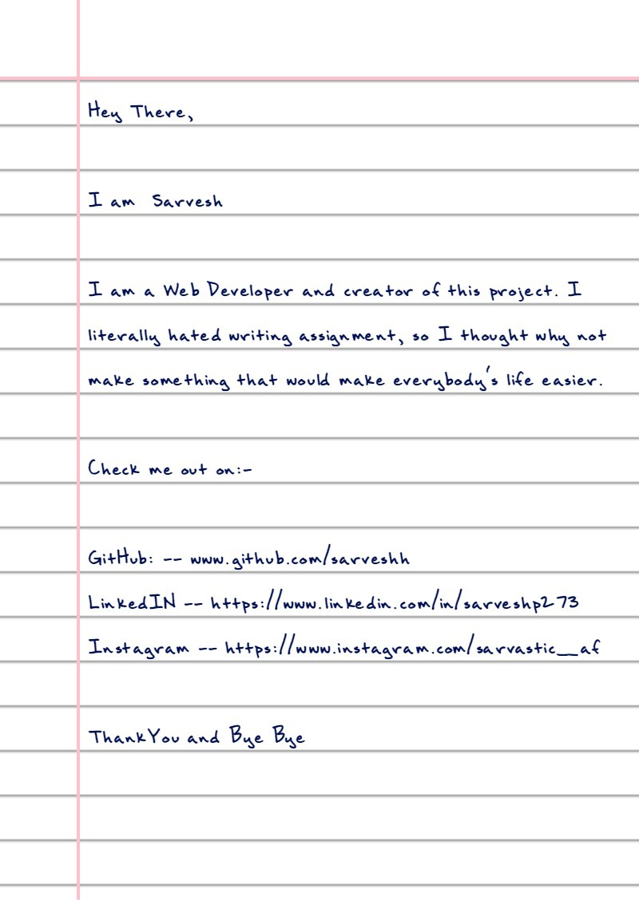
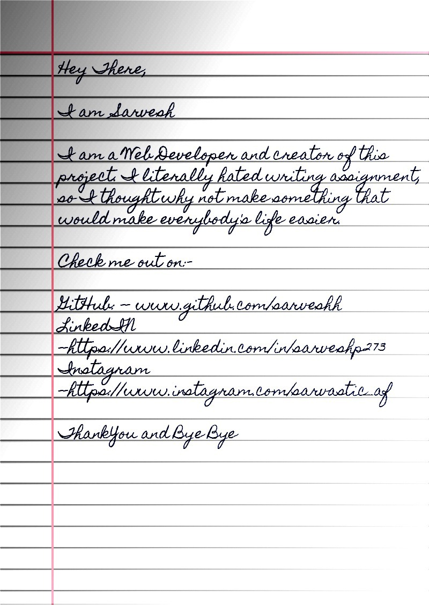
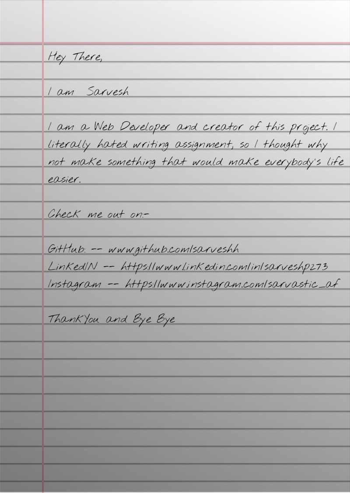

<h1 align="center">Welcome to handwriter 👋</h1>

  For a simple demo of
  <a href="https://handwriterr.herokuapp.com/">
    Handwriter
  </a> 
  This project is still under development

 
   
    
    

## Sample Output

## 📚 External Libraries

- [html2canvas](https://github.com/niklasvh/html2canvas) - Turns DOM into Canvas.
- [jsPDF](https://github.com/MrRio/jsPDF) - To generate PDF from images.
- [serve](https://github.com/zeit/serve) - Start local server
- [express](https://expressjs.com) - Project server

---

 &nbsp; 
